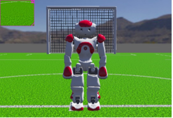
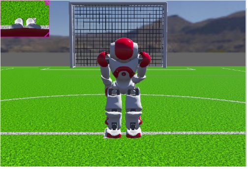
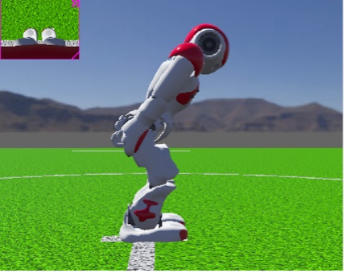
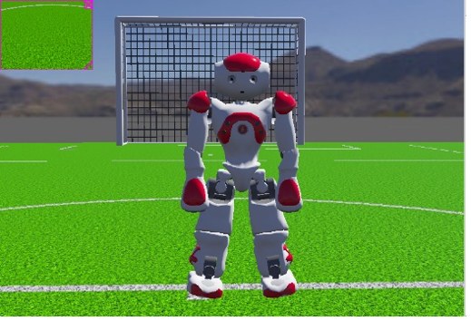

# RobotBowingBehaviour
**© 2025 Aashir Javed Mummunka — All Rights Reserved**

This project implements a physics-aware bowing and side-step motion for a humanoid robot in Webots, using Python. It combines inverse kinematics, smooth interpolation, and inertial-sensor feedback to generate stable and realistic full-body movements.

## Demonstration Images

### Upright Neutral Posture

### Bowing (Front View)

### Bowing (Side View)

### Side-stepping Behaviour

---

## **Features**

- Full bowing sequence with smooth easing  
- IK-based leg angle computation (hip–knee–ankle coordination)  
- Arm gesture synchronization  
- Side-step motion using non-linear interpolation  
- Motor-safe angle clamping and sensor validation  

---

## **Technical Overview**

- 2-link planar leg IK solver  
- Smoothstep and sine interpolation functions  
- IMU-based head-pitch compensation  
- Unified pose updater (head, arms, legs)  
- Runs as a Python controller using Webots API  
